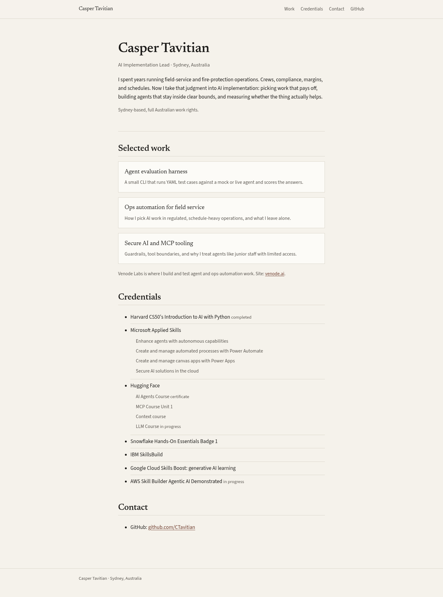
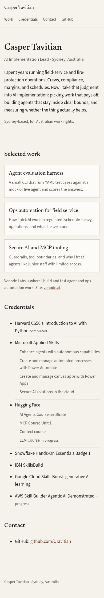

# AI Lead portfolio

Personal site for Casper Tavitian. Static Next.js export for GitHub Pages or Vercel.





## Stack

- Next.js App Router, TypeScript, `output: 'export'`
- No trackers
- Newsreader + Source Sans 3, near-black on off-white, one muted accent

## Local

```bash
npm install
BASE_PATH= npm run build
npx serve out
```

Default `BASE_PATH` is `/ai-lead-portfolio` for a GitHub Pages project site. Set `BASE_PATH=` for Vercel root or local preview at `/`.

## Eval harness

```bash
npm run test:harness
npm run eval:sample
```

Details: [tools/agent-eval-harness/README.md](tools/agent-eval-harness/README.md)

## Deploy

### GitHub Pages

1. Create public repo `CTavitian/ai-lead-portfolio`
2. Push this tree
3. Settings → Pages → GitHub Actions
4. Workflow: `.github/workflows/pages.yml`
5. Site URL: `https://ctavitian.github.io/ai-lead-portfolio/`

### Vercel

1. Import the repo
2. Set env `BASE_PATH` to empty
3. Build command `npm run build`, output directory `out`

## Licence

MIT (code). Writing stays with the author.
