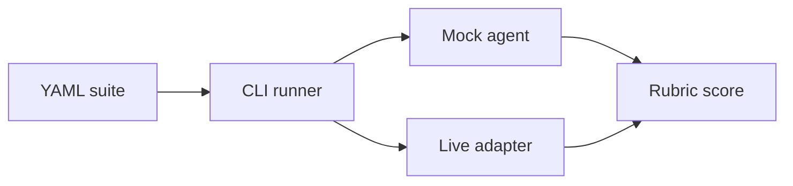
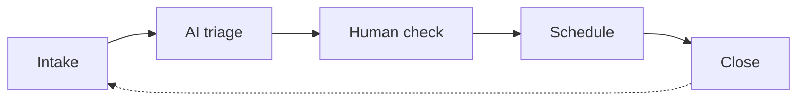
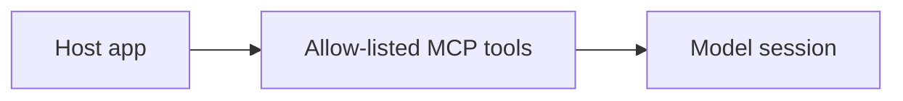

# Architecture diagrams

SVG files in `public/diagrams/` are the site assets. Mermaid sources below match those drawings for editing.

## Eval harness

```mermaid
flowchart LR
  suite[YAML suite] --> cli[CLI runner]
  cli --> mock[Mock agent]
  cli --> live[Live adapter]
  mock --> rubric[Rubric score]
  live --> rubric
```

## Ops loop

```mermaid
flowchart LR
  intake[Intake] --> triage[AI triage]
  triage --> human[Human check]
  human --> schedule[Schedule]
  schedule --> close[Close]
  close -.-> intake
```

## Secure MCP

```mermaid
flowchart LR
  host[Host app] --> tools[Allow-listed MCP tools]
  tools --> model[Model session]
```
